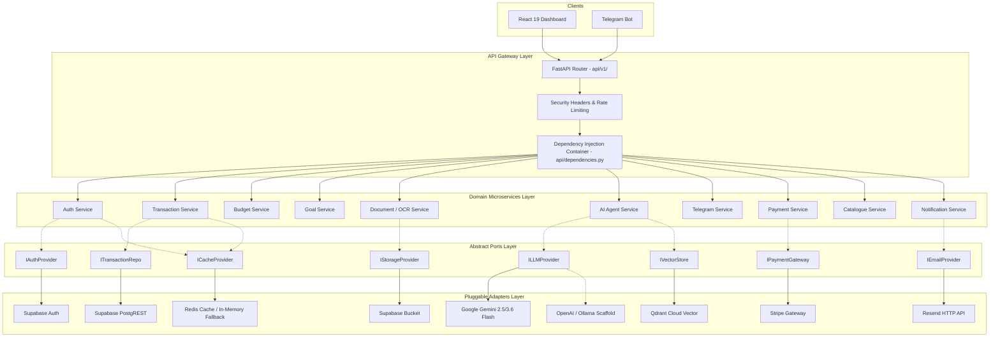

# 🏛️ 01. System Architecture & Hexagonal Blueprint

<p align="center">
  
  
  
  
</p>

> **ARTHA AI — Enterprise Financial Backend Architecture**  
> *A decoupled, modular microservices architecture designed for zero vendor lock-in, sub-second latency, and horizontal scalability.*

---

## 📌 1. Architectural Philosophy: Ports & Adapters

Rather than coupling business logic to external databases, SDKs, or cloud services, ARTHA AI uses **Hexagonal Architecture (Ports and Adapters)**:



---

## 🧩 2. Domain Microservices Breakdown

| Domain Microservice | Core Responsibility | Key Ports Consumed |
| :--- | :--- | :--- |
| **`AuthService`** | User session validation & cached user synchronization | `UserRepositoryPort`, `CachePort` |
| **`TransactionService`** | Financial ledger, relative date parsing, auto-income tagging, cached summaries | `TransactionRepositoryPort`, `CachePort` |
| **`BudgetService`** | Category budget limits, monthly spending tracking | `BudgetRepositoryPort`, `CachePort` |
| **`GoalService`** | Savings goals target tracking and progress computation | `GoalRepositoryPort`, `CachePort` |
| **`DocumentService`** | Receipt/statement uploads, Gemini Vision OCR, and auto-batch transaction creation | `DocumentRepositoryPort`, `StorageProviderPort`, `LLMProviderPort`, `TransactionService` |
| **`AIAgentService`** | LangGraph state machine, fast-path guardrail, compact context assembly, structured actions | `LLMProviderPort`, `VectorStorePort`, `TransactionRepositoryPort`, `CachePort` |
| **`MemoryService`** | User financial habits & preference vector persistence | `VectorStorePort`, `LLMProviderPort` |
| **`TelegramService`** | Webhook update dispatcher, direct-lookup link code verification, interactive UX | `UserRepositoryPort`, `AIAgentService`, `DocumentService`, `TransactionService` |
| **`NotificationService`** | Automated HTML financial report generation & email dispatch | `EmailProviderPort`, `TransactionRepositoryPort` |
| **`PaymentService`** | Stripe subscriptions, checkout sessions, and webhook processing | `PaymentGatewayPort` |
| **`CatalogueService`** | Standardized spending categories, merchant rules, and budget templates | Pure Domain Service |

---

## 🔄 3. End-to-End Request Lifecycle

```
[ Incoming HTTP Request / Webhook ]
                │
                ▼
   [ Security Headers Middleware ]
   (Injects nosniff, DENY, HSTS)
                │
                ▼
   [ Sliding-Window Rate Limiter ]
   (Checks Redis/Memory: 10-20 req/min)
                │
                ├── (Limit Exceeded) ──▶ [HTTP 429 Too Many Requests]
                │
                ▼
   [ Pydantic v2 Schema Validation ]
   (Enforces bounds: gt=0, lengths, regex)
                │
                ▼
   [ JWT Bearer Authentication ]
   (Validates token & checks cached user sync)
                │
                ▼
   [ Domain Microservice Execution ]
   (Pure business logic via Port Abstractions)
                │
                ▼
   [ Pluggable Adapter Execution ]
   (Redis / Supabase / Gemini / Qdrant / Stripe)
                │
                ▼
   [ Clean JSON Response Formatted ]
```

---

*Continue Reading:*
- [02. Token & Cache Optimization](02_TOKEN_AND_CACHE_OPTIMIZATION.md)
- [03. Security & Guardrails](03_SECURITY_AND_GUARDRAILS.md)
- [04. Agent Workflow & Memory](04_AGENT_WORKFLOW_AND_MEMORY.md)
- [05. API Specification](05_API_DOCUMENTATION.md)
- [06. Deployment Architecture](06_DEPLOYMENT.md)
