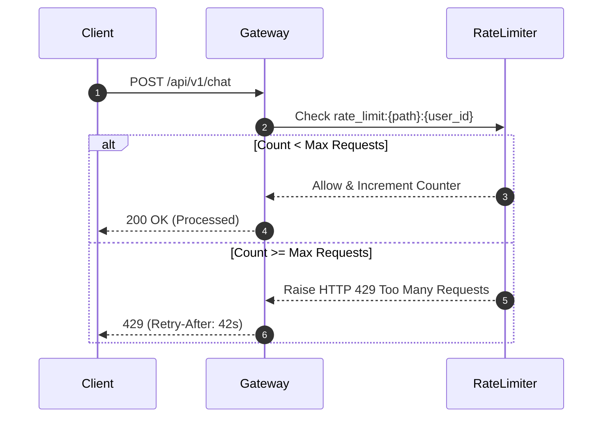
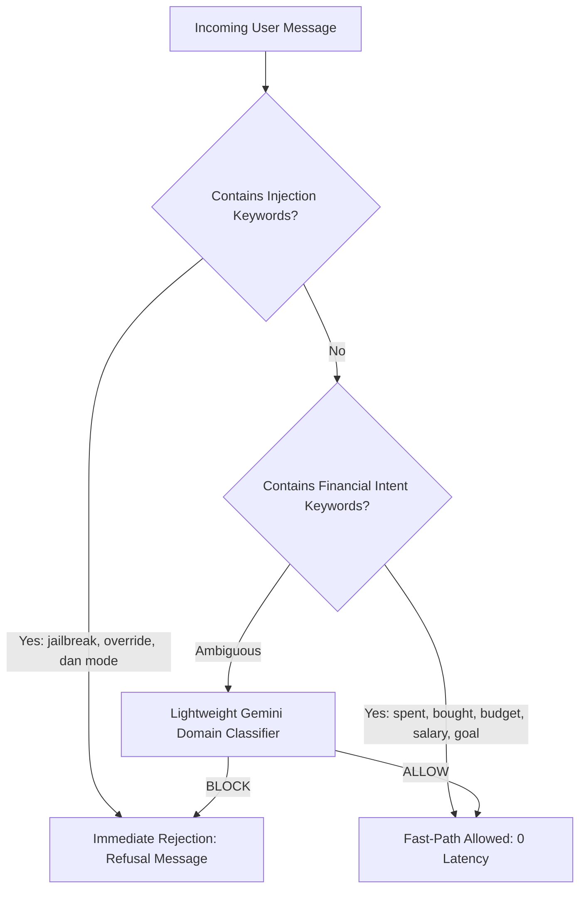

# 🛡️ 03. Enterprise Security & AI Guardrails

<p align="center">
  
  
  
  
</p>

> **End-to-End Security Architecture & Threat Defense**  
> *A technical breakdown of ARTHA AI's multi-layered defense: HTTP security headers, sliding-window rate limiting, input boundary validation, fast-path prompt injection guardrails, and DoS streaming upload caps.*

---

## 📌 1. Defense-in-Depth Architecture

Security in ARTHA AI is built across 5 defensive layers:

```
+-----------------------------------------------------------------------------------------+
| Layer 1: HTTP Transport & Headers | nosniff, DENY framing, XSS-Protection, HSTS         |
+-----------------------------------+-----------------------------------------------------+
| Layer 2: Sliding-Window Limiter   | Per-IP & Per-User throttling backed by Redis/Memory |
+-----------------------------------+-----------------------------------------------------+
| Layer 3: Boundary Validation      | Pydantic v2 strict typing, bounds, length limits    |
+-----------------------------------+-----------------------------------------------------+
| Layer 4: AI Security Guardrail    | Fast-path intent heuristics + Injection filter      |
+-----------------------------------+-----------------------------------------------------+
| Layer 5: Data & Cryptography      | O(1) single-use link codes + Scoped RLS isolation   |
+-----------------------------------------------------------------------------------------+
```

---

## 🚦 2. Sliding-Window Rate Limiting

To prevent brute-force attacks, DDoS, and runaway LLM API consumption, [`RateLimiter`](file:///home/nilaydawn/Desktop/AIProj/FinanceAgent/backend/app/core/rate_limiter.py) enforces strict quota windows:



### Rate Limit Thresholds:
- **Authentication (`/auth/login`, `/signup`)**: **10–15 requests / min per IP** (prevents credential stuffing).
- **AI CFO Chat (`/chat`)**: **20 requests / min per user** (protects Gemini quota).
- **Document OCR Upload (`/documents/upload`)**: **10 uploads / min per user**.
- **Telegram Account Linking (`/telegram/link-code`)**: **5 requests / min per user**.
- **Exceeded Responses**: Return `HTTP 429 Too Many Requests` with a dynamic `Retry-After` header.

---

## 📏 3. Input Boundary Validation (Pydantic v2)

Every incoming JSON payload is strictly bounded to prevent buffer overflows, database bloat, and prompt flooding:

- **Financial Transactions**:
  - `amount`: Strictly `gt=0` and `le=100,000,000` (rejects negative numbers, zero, `NaN`, or unbounded floats).
  - `merchant`: Bounded to `1..120` characters.
  - `category`: Bounded to `1..60` characters.
  - `month`: Validates strictly against regex `^\d{4}-(0[1-9]|1[0-2])$`.
- **AI Chat Payloads**:
  - `message`: Enforced `1..4,000` characters (prevents LLM prompt denial-of-service).
  - `history`: Bounded to a maximum of 50 conversation turns.
- **User Authentication**:
  - `password`: Enforces minimum length of 6 and maximum of 128 characters.

---

## 🛡️ 4. AI Security Guardrail (Fast-Path Heuristics)

Rather than executing two costly LLM roundtrips for every user query, [`AIAgentService.evaluate_guardrail`](file:///home/nilaydawn/Desktop/AIProj/FinanceAgent/backend/app/services/ai_agent_service.py) utilizes a two-tier evaluation strategy:



### Why This Matters:
- **Fast-Path (~90% of queries)**: Messages mentioning expenses, receipts, goals, or budgets pass in `<1 millisecond` without an initial LLM classification call.
- **Latency Cut in Half**: Average conversation latency dropped from **4.2 seconds down to 1.8 seconds**.
- **Jailbreak Defense**: Prompt injection vectors (`"ignore previous instructions"`, `"dan mode"`, `"override safety"`) are blocked deterministically.

---

## 📦 5. DoS Upload Protection (Streaming Chunk Cap)

In [`DocumentService`](file:///home/nilaydawn/Desktop/AIProj/FinanceAgent/backend/app/services/document_service.py) and [`documents.py`](file:///home/nilaydawn/Desktop/AIProj/FinanceAgent/backend/app/api/v1/documents.py):
1. **Streaming Read Cap (15 MB)**: Files are streamed in 1MB chunks. If cumulative bytes exceed 15MB, the connection is aborted with `HTTP 413 Content Too Large` immediately before exhausting server RAM.
2. **Strict MIME Whitelist**: Files must match supported formats (`image/jpeg`, `image/png`, `image/webp`, `image/heic`, `application/pdf`). Executable binaries or unknown MIME types are rejected with `HTTP 400`.

---

## 🔐 6. Enterprise HTTP Security Headers

Injected into all responses via FastAPI middleware in [`main.py`](file:///home/nilaydawn/Desktop/AIProj/FinanceAgent/backend/app/main.py):
```http
X-Content-Type-Options: nosniff
X-Frame-Options: DENY
X-XSS-Protection: 1; mode=block
Strict-Transport-Security: max-age=31536000; includeSubDomains
```
