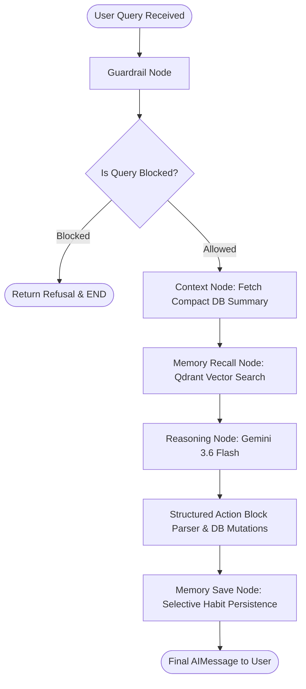

# 🧠 04. LangGraph Agent Workflow & Vector Memory

<p align="center">
  
  
  
  
</p>

> **Stateful Agentic Reasoning & Semantic Memory Persistence**  
> *A technical breakdown of the LangGraph state machine, fast-path guardrail routing, compact financial context formatting, structured JSON action block execution, and Qdrant semantic memory.*

---

## 📌 1. LangGraph State Machine Architecture

The AI reasoning engine is implemented as a state machine inside [`AIAgentService`](file:///home/nilaydawn/Desktop/AIProj/FinanceAgent/backend/app/services/ai_agent_service.py):



---

## 🛠 2. Graph Node Lifecycle & Responsibilities

| State Graph Node | Implementation Details | Performance & Security Optimization |
| :--- | :--- | :--- |
| **`guardrail`** | Regex injection detection + financial intent fast-path | Bypasses classification LLM for 90% of queries; blocks jailbreak attempts in <1ms. |
| **`fetch_context`** | Gathers recent transactions, active budgets, and savings goals | 180s Redis/Memory cached compact string format; reduces prompt size by 83%. |
| **`recall_memory`** | Queries Qdrant vector collection (`gemini-embedding-001`, 3072-dim) | Scoped by `user_id` keyword filter; retrieves top-3 relevant personal financial rules. |
| **`reasoning`** | Calls Gemini with compact system prompt and conversation history | Synthesizes recommendations and appends structured ```json_action``` blocks. |
| **`action_execution`** | Regex matches and executes multiple structured JSON actions | Performs atomic ledger updates (`create_transaction`, `create_budget`, `create_goal`). |
| **`save_memory`** | Evaluates message for explicit habit/preference keywords | Only saves high-signal user rules (salary date, habits), preventing vector store bloat. |

---

## ⚡ 3. Structured Action Block Execution Engine

When users express intent to log expenses, set budgets, or create savings goals naturally (e.g. *"Spent ₹450 on Swiggy and got ₹50,000 salary yesterday"*), the LLM appends structured action blocks:

```json_action
{"action": "create_transaction", "data": {"amount": 450.0, "category": "Food & Dining", "merchant": "Swiggy", "date": "2026-10-02"}}
```
```json_action
{"action": "create_transaction", "data": {"amount": 50000.0, "category": "Income", "merchant": "Salary Deposit", "date": "2026-10-02"}}
```

### Execution Flow:
1. Regex extracts all ```json_action``` blocks in a single turn.
2. Ingests actions into [`TransactionService`](file:///home/nilaydawn/Desktop/AIProj/FinanceAgent/backend/app/services/transaction_service.py) with automatic income classification and date normalization.
3. Automatically triggers [`CachePort.invalidate_user(user_id)`](file:///home/nilaydawn/Desktop/AIProj/FinanceAgent/backend/app/ports/cache.py).
4. Persists a semantic memory record into Qdrant for long-term recall.
5. Cleans and strips the raw JSON blocks from the user-facing response message.
