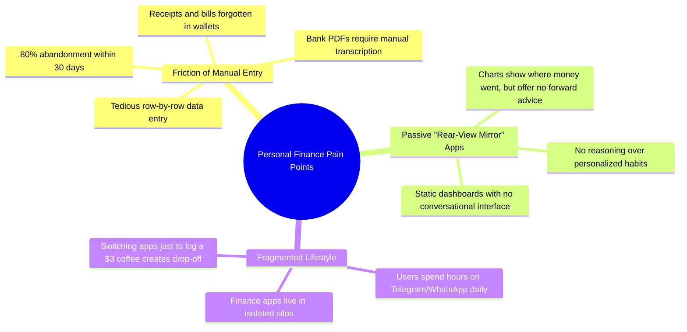

# 📄 Product Requirement Document (PRD)
## Project ARTHA AI — Autonomous Personal Financial Intelligence Copilot

<p align="center">
  
  
  
  
</p>

---

## 📌 Executive Summary

**ARTHA AI** is a full-stack, autonomous personal financial copilot designed to eliminate the friction of personal money management. By pairing a modern **React + Redux Toolkit** web client with a **FastAPI hexagonal backend**, **Google Gemini multimodal vision models**, **LangGraph multi-node agent orchestration**, and a **Telegram conversational bot**, ARTHA bridges the gap between passive bookkeeping apps and active financial intelligence.

Users can converse in natural language, upload receipts and multi-page bank statements, receive automated monthly financial report emails, and track budgets and goals in real time across the web and Telegram.

---

## 🚨 The Problem Statement

Personal finance tracking is one of the most abandoned digital habits worldwide. Through user research and industry data, three critical pain points dominate:



### 1. High Manual Friction & Habit Decay
- **The Reality**: The average expense tracking app requires 5–7 taps per transaction (amount, merchant, category, date, payment method, notes).
- **The Consequence**: Users skip logging after 2 weeks, rendering their dashboards inaccurate and ultimately leading to app abandonment.

### 2. Unstructured Financial Data Traps
- **The Reality**: Financial transactions exist across paper receipts, PDF bank statements, SMS alerts, and delivery invoices.
- **The Consequence**: Users are forced to manually reconcile transactions or completely ignore cash/physical receipts.

### 3. Lack of Contextual AI Intelligence
- **The Reality**: Most "AI finance apps" are basic GPT wrappers that output generic budgeting tips ("spend less on coffee") without real-time database access or memory of user habits.
- **The Consequence**: Users cannot ask contextual questions like *"Can I afford a ₹60,000 laptop next month based on my last 3 months of savings?"* and receive answers grounded in their real financial data.

---

## 💡 The Proposed Solution: ARTHA AI

ARTHA AI reimagines personal finance as an **autonomous, proactive assistant** that meets users where they already communicate:


### Core Value Propositions
1. **Zero-Effort Logging**: Send a photo of a restaurant receipt on Telegram or upload a PDF bank statement; ARTHA extracts every transaction, categorizes it, and inserts it into the user ledger in seconds.
2. **Context-Grounded AI CFO**: A LangGraph agent with real-time access to the user's transactions, active budgets, and savings goals. It can execute mutations (adding a budget, logging an income) directly from natural language chat.
3. **Long-Term Habit Memory**: Uses vector embeddings to remember spending preferences, recurrent financial goals, and user constraints across sessions.
4. **Omnichannel Experience**: Work on a rich, responsive React desktop dashboard or chat with the bot on mobile Telegram using ephemeral link codes.

---

## 🎯 Target User Personas

| Persona | Description | Primary Needs & Frustrations | How ARTHA Solves It |
| :--- | :--- | :--- | :--- |
| **Priya, 26**<br>*Product Designer* | Busy tech professional with multiple cards, UPI accounts, and dining expenses. | Hates logging small expenses manually; forgets where her paycheck goes every month. | Snaps photos of receipts in Telegram; receives automated end-of-month breakdown emails. |
| **Rahul, 31**<br>*Freelance Consultant* | Irregular monthly income with deductible business expenses and fluctuating tax liabilities. | Needs to extract transactions from multiple client bank statements every quarter. | Uploads multi-page bank statement PDFs; ARTHA automatically parses and bulk-logs all entries. |
| **Arjun, 22**<br>*College Graduate* | First full-time job; wants to save ₹1,00,000 for an emergency fund and avoid overspending. | Overwhelmed by complex spreadsheets; needs proactive guidance on savings targets. | Chats with ARTHA: *"Can I afford to go to Goa this weekend?"* grounded in his actual budget. |

---

## 📋 Features Matrix & Implementation Scope

The following table outlines the **promised requirements** and the **delivered technical implementation**:

| Domain Module | Promised Feature | Delivered Implementation Status | Technical Highlights |
| :--- | :--- | :--- | :--- |
| **Auth & Profile** | Secure user registration, authentication, and session handling. | ✅ **Delivered** (`modules/auth/`) | Supabase JWT Auth, Redis-cached user sync (600s TTL) eliminating DB bottlenecks, sliding-window rate limiting. |
| **Finance Ledger** | Full CRUD for transactions, monthly summaries, and income auto-tagging. | ✅ **Delivered** (`modules/finance/`) | `TransactionService`, `BudgetService`, `GoalService` with user-isolated cache invalidation and relative date parsing (`"yesterday"`). |
| **Document OCR** | Vision-based extraction of receipts and multi-transaction bank statements. | ✅ **Delivered** (`modules/documents/`) | Gemini Vision multimodal structured outputs, Supabase Storage with signed URLs, streaming 15MB file-size limit DoS defense. |
| **AI CFO Agent** | Conversational finance assistant with reasoning and database tool execution. | ✅ **Delivered** (`modules/agent/`) | LangGraph state machine, fast-path intent heuristics (<1ms), action block parsing (`json_action`), bring-your-own-API-key support. |
| **Semantic Memory** | Persistent long-term storage of user habits, goals, and constraints. | ✅ **Delivered** (`modules/agent/`) | Qdrant Cloud vector embeddings with cosine similarity and automatic user preference extraction. |
| **Telegram Bot** | Conversational logging, OCR photo analysis, and PDF statement imports via bot. | ✅ **Delivered** (`modules/telegram/`) | Webhook-driven bot, single-use 10-minute ephemeral link codes (`FP-XXXX`) with indexed lookup replacing table scans. |
| **Email Reporting** | Scheduled/on-demand monthly financial reports sent directly to email. | ✅ **Delivered** (`modules/reports/`) | Decoupled HTML email templates (`monthly_report.html`, `welcome.html`), dual-engine email provider (Resend + SMTP). |
| **Catalogue & Rules** | Standard categories, merchant keyword matching, and budget templates. | ✅ **Delivered** (`modules/catalogue/`) | 10 standard categories, automated merchant rules (Swiggy, Uber, Amazon), 50/30/20 & Aggressive Saver templates. |
| **Billing & Payments** | Subscription tiers, checkout sessions, and webhook processing. | ✅ **Delivered** (`modules/payments/`) | Stripe Checkout integration with signature verification and mock fallback for zero-dependency local runs. |

---

## 🔒 Non-Functional Requirements (NFRs)

```
┌─────────────────────────────────────────────────────────────────────────────┐
│                         NON-FUNCTIONAL SPECIFICATIONS                       │
├─────────────────────────┬───────────────────────────────────────────────────┤
│ Performance & Latency   │ • Cache hit response time: < 5ms                  │
│                         │ • Guardrail evaluation: < 1ms for safe queries    │
│                         │ • Frontend bundle build: < 700ms (Rollup split)   │
├─────────────────────────┼───────────────────────────────────────────────────┤
│ Security & Isolation    │ • Sliding-window rate limiting on all endpoints   │
│                         │ • Strict tenant-isolated cache keys by user_id    │
│                         │ • Enterprise HTTP headers (CSP, HSTS, X-Frame)    │
│                         │ • DoS protection: 15MB streaming chunk limit      │
├─────────────────────────┼───────────────────────────────────────────────────┤
│ Reliability & Testing   │ • 23/23 Automated Unit & Integration Tests pass   │
│                         │ • Zero circular dependencies across domain modules│
│                         │ • Graceful fallback for cache and payment ports   │
└─────────────────────────┴───────────────────────────────────────────────────┘
```

---

## 🗺️ Product Roadmap & Future Horizons

- **Phase 1 (Delivered)**: Complete Hexagonal Backend, React 19 + Redux Toolkit SPA, Telegram Bot, Multimodal OCR, LangGraph Agent, and Email Templates.
- **Phase 2 (Upcoming)**: Account Aggregator (AA) framework integration for automated real-time Indian bank statement sync via RBI-regulated NBFCs.
- **Phase 3 (Future)**: Mobile companion app built with React Native reusing existing Redux Toolkit slices and API client.
