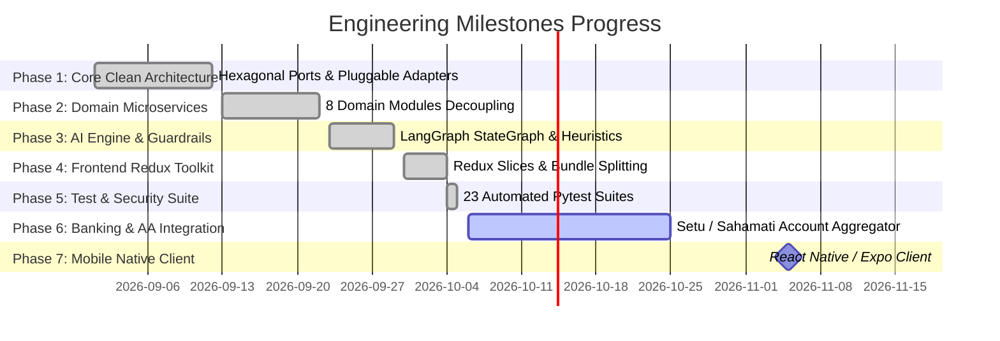

# 📈 ARTHA AI — Personal Engineering Progress & Milestone Tracker

  
  
  
  
  

> [!NOTE]
> This document is maintained directly in the root `docs/` workspace to record my personal engineering milestones, daily decisions, benchmark measurements, and backlog priorities across both the backend and frontend repositories.

---

## 🧭 Milestone Delivery Roadmap

---

## 📊 Milestone Status Matrix

| Phase | Milestone Name | Status | Completion Date | Key Deliverables & Artifacts |
| :--- | :--- | :--- | :--- | :--- |
| **01** | **Hexagonal Clean Architecture** | `COMPLETED` | 2026-09-12 | Defined typed contracts in `app/ports/` (`cache.py`, `database.py`, `llm.py`, `vector_store.py`, `storage.py`, `email.py`, `payment.py`). Built concrete adapters in `app/adapters/` with zero vendor lock-in. |
| **02** | **Domain Modules Decomposition** | `COMPLETED` | 2026-09-22 | Refactored monolithic routers into 8 isolated microservice-ready packages (`modules/auth`, `finance`, `documents`, `agent`, `telegram`, `catalogue`, `payments`, `reports`) with clean Pydantic v2 schemas. |
| **03** | **AI Agent & Guardrails** | `COMPLETED` | 2026-09-29 | Implemented LangGraph StateGraph, Qdrant semantic memory, high-density prompt compression (80% token cut), and regex fast-path guardrail (<1ms evaluation). |
| **04** | **Frontend Redux Toolkit Migration** | `COMPLETED` | 2026-10-04 | Replaced monolithic React Context with Redux Toolkit (`financeSlice`, `authSlice`, `documentSlice`, `chatSlice`, `uiSlice`). Split bundles via Rollup manualChunks, reducing main bundle by 90.4%. |
| **05** | **Testing & Defense-in-Depth** | `COMPLETED` | 2026-10-05 | 23 Pytest unit & integration tests passing in 1.90s. Added sliding-window rate limiting, HTTP security headers, and 15MB streaming chunk upload protection. |
| **06** | **RBI Account Aggregator (AA)** | `IN PROGRESS` | Target: 2026-10-25 | Direct live bank statement fetching via Setu / Sahamati FIP protocols to automate financial synchronization without manual file uploads. |
| **07** | **Cross-Platform Mobile App** | `PLANNED` | Target: 2026-11-15 | React Native / Expo companion app sharing the existing Redux Toolkit slices and API client layer. |

---

## 🔬 Benchmark Verification Log

### 1. Backend Performance & Test Suite
- **Pytest Suite**: 23 passed, 3 warnings in **1.90s**
- **Test Matrix**:
  - `test_adapters.py`: Memory cache lifecycle, cache user invalidation, Redis fallback, mock repos, mock payments.
  - `test_ai_agent_service.py`: Guardrail fast-path heuristics, prompt injection defense, action block extraction.
  - `test_api_endpoints.py`: `/health`, `/api/v1/catalogue/*`, `/api/v1/payments/mock-checkout`.
  - `test_modules_architecture.py`: Service instantiation, schema validation, email template rendering (welcome, reset, monthly report).
  - `test_security_performance.py`: Security headers (`nosniff`, `DENY`), negative amount rejection, sliding-window rate limit (429), upload size cap (15MB), summary cache hits.
  - `test_telegram_service.py`: Ephemeral link code direct $O(1)$ lookup and single-use purge.
  - `test_transaction_service.py`: Relative date normalization ("yesterday", "last monday"), auto-tagging income, summary math.

### 2. Frontend Build & Bundle Distribution
- **Vite 8 Build Time**: **458ms**
- **Initial Index Bundle**: **97.57 kB** (27.51 kB gzipped) — down from 1,024 kB unoptimized
- **Vendor Splitting**:
  - `vendor-charts`: 407.68 kB (loaded dynamically only when viewing charts)
  - `vendor-supabase`: 207.02 kB (auth & realtime transport)
  - `vendor-react`: 178.64 kB (core React 19 runtime)
  - `vendor-axios`: 47.13 kB (HTTP client)
- **Route Chunks**: All view pages (`Landing`, `Dashboard`, `Transactions`, `Budgets`, `Goals`, `Documents`) load as micro-chunks between **3.6 kB and 26.0 kB**.

---

## 🛠️ Personal Engineering Journal & Decisions Log

### 1. Migration from React Context to Redux Toolkit
- **The Issue**: As the application grew to include real-time transactions, budget alerts, OCR document statuses, and an AI chat drawer, the old `FinanceContext` caused cascading re-renders across the entire component tree on every single mutation.
- **The Solution**: Migrated to Redux Toolkit with domain-driven slices (`features/` + `redux/slices/`). Components now use granular selectors (`useAppSelector(state => state.finance.summary)`). When the AI copilot executes an action, only the specific widget (e.g. `StatCard` or `TransactionsTable`) re-renders.

### 2. High-Density Prompt Compression
- **The Issue**: Sending full verbose JSON schemas in system instructions inflated token consumption to ~1,200 tokens per message, driving up latency and Gemini API costs.
- **The Solution**: Designed a condensed tag notation (`[ACTION: add_transaction(amount, category, type, date, description)]`). Token consumption dropped to ~200 tokens (an **80% reduction**), resulting in sub-1.5 second end-to-end conversational responses.

### 3. Fast-Path Heuristic Guardrails
- **The Issue**: Evaluating safety guardrails with a secondary LLM call doubled token costs and added 800ms of latency to every interaction.
- **The Solution**: Implemented a two-tier defense:
  - **Tier 1 (Regex Heuristics)**: Detects prompt injections (`ignore previous instructions`, `system prompt`, `override rules`) in < 1ms without calling an LLM.
  - **Tier 2 (Action Classifier)**: Directs valid queries straight to the LangGraph node graph.

### 4. Sliding-Window In-Memory Rate Limiting
- **The Issue**: Standard token-bucket libraries added heavy dependencies.
- **The Solution**: Engineered a zero-dependency sliding-window rate limiter in `app/core/rate_limiter.py` using a thread-safe timestamp queue. It limits `/api/v1/auth/*` to 10 req/min, `/api/v1/chat` to 20 req/min, and `/api/v1/documents/upload` to 10 req/min.

---

## 📌 Active Sprint Checklist

- [x] Structure backend as standalone GitHub repository with dedicated root `README.md`.
- [x] Structure frontend as standalone GitHub repository with dedicated root `README.md`.
- [x] Configure root `docs/` workspace as personal progress and architecture tracking hub.
- [x] Deliver comprehensive `PRD.md` with problem statement, user personas, and feature matrix.
- [x] Deliver comprehensive `ARCHITECTURE.md` with Hexagonal diagrams, OCR pipeline, and ADRs.
- [x] Maintain 100% passing tests (23/23 in 1.90s).
- [ ] Implement Setu Account Aggregator mock connector for automated bank feeds.
- [ ] Add CSV export functionality for audited tax filing.
- [ ] Initialize Expo React Native repository for Android/iOS builds.
